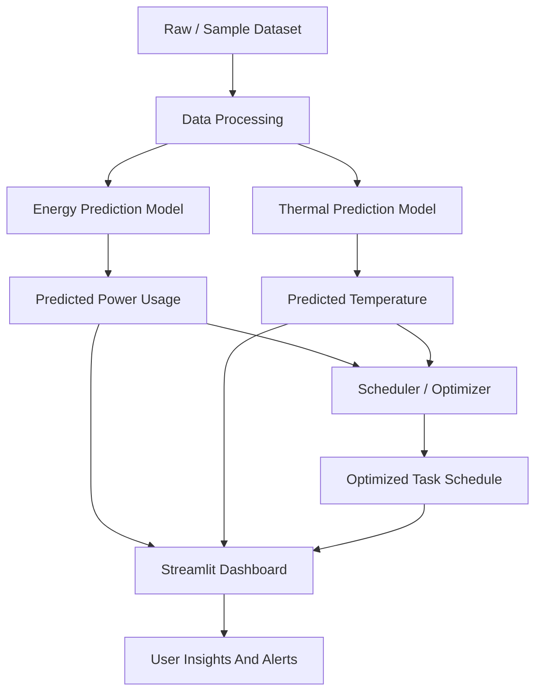

# System Architecture

## Module Description

The project has four main software modules.

1. Dataset module

This module stores the sample data and future raw datasets. The current prototype uses `data/processed/samples/data_center_sample.csv`.

2. Energy prediction module

This module trains a Random Forest Regression model to predict `power_usage` from workload features such as CPU usage, memory usage, disk I/O, network I/O, task duration, and priority.

3. Thermal prediction module

This module trains a Random Forest Regression model to predict `temperature` using workload, power, outside temperature, and cooling efficiency.

4. Scheduler and dashboard module

The scheduler assigns high-priority tasks to better server candidates based on CPU, memory, power, and thermal conditions. The dashboard displays predictions, alerts, charts, and optimized scheduling results.
